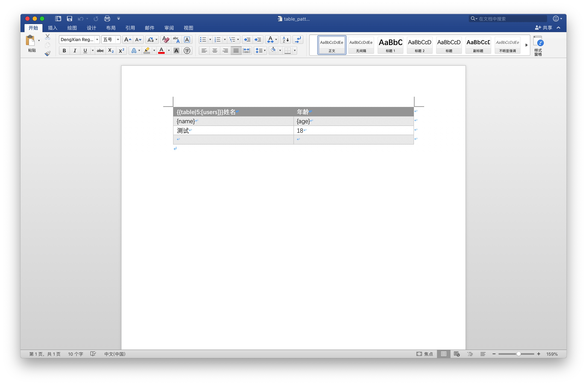
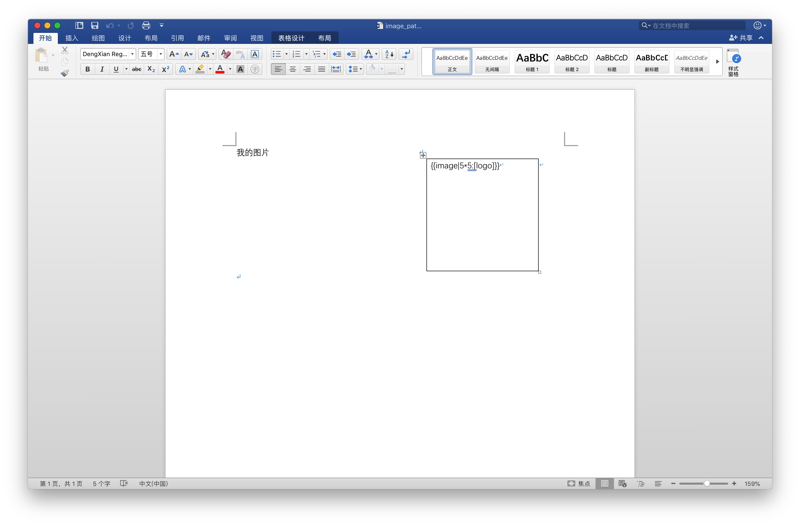

# 说明

## 二次开发

这里是基于原始版本进行修改的说明

### 扩展

由于 poi-tl 开源项目对已经存在的表格动态值替换不友好，需要自己写代码实现。

因此，基于源码进行二次开发。

#### 表格

语法：`{{table|limit:var}}`

- table说明是表格

- limit 为数据填充的行数，数据不足补空
- var 为填充数据（JSON）的 key，可以是一个数组。

模板：



其中：

- 姓名的前面出现的`{{table|5:[users]}}`，代表了这是一个表格模板，`users`则说明 JSON 数据中存在一个 users 的 key 。
- 表格的第二行变量会根据传递的值动态替换，{name}、{age} 等模板，则说明 users 这个 key 中的 JSON 对象存在 name、age 这两个key。
- 由于数据只有2条，限制5条，因此补空行3条

测试代码：

```java
@Test
public void run() {
  Path path = Paths.get("src/test/resources", "table_pattern.docx");
  XWPFTemplate template = XWPFTemplate.compile(path.toFile())
    // 数据
    .render(new HashMap<String, Object>() {{
      put("users", Arrays.asList(new User("张三", 1), new User("李四", 2)));
    }});
  // 输出
  Path outPath = Paths.get("src/test/resources", "table_pattern_out.docx");
  try (OutputStream os = new BufferedOutputStream(new FileOutputStream(outPath.toFile()))) {
    template.write(os);
  } catch (IOException e) {
    LOG.error("render tpl error", e);
  } finally {
    try {
      template.close();
    } catch (IOException e) {
      LOG.error("close template error", e);
    }
  }
}
```

可以看到这里的 JSON 对象（Java中可以是一个hashmap）存在 users 这个 key，且存在 2 条数据。User 这个对象有两个属性 name、age ，模板在解析时，会自动取值。

输出：


总结：表格正常渲染，而且样式也正常保留，原来的数据也会保留下来，数据不足补空行。

#### 图片

语法：`{{image|height*width:var}}`

- image说明是图片
- height*width代表图片的高度和宽度，单位为厘米
- var为填充数据（JSON）的 key，是一个图片字节通过base64加密的字符串

模板：



测试代码：

```java
@Test
public void run() throws IOException {
  Path logoPath = Paths.get("src/test/resources", "logo.png");
  byte[] bytes = Files.readAllBytes(logoPath);
  byte[] encode = Base64.getEncoder().encode(bytes);

  Path path = Paths.get("src/test/resources", "image_pattern.docx");
  XWPFTemplate template = XWPFTemplate.compile(path.toFile())
    // 数据
    .render(new HashMap<String, Object>() {{
      put("logo", new String(encode));
    }});
  // 输出
  Path outPath = Paths.get("src/test/resources", "image_pattern_out.docx");
  try (OutputStream os = new BufferedOutputStream(new FileOutputStream(outPath.toFile()))) {
    template.write(os);
  } catch (IOException e) {
    LOG.error("render tpl error", e);
  } finally {
    try {
      template.close();
    } catch (IOException e) {
      LOG.error("close template error", e);
    }
  }
}
```

输出：


总结：图片能正常根据高度宽度渲染出来

## 依赖

## 发布

